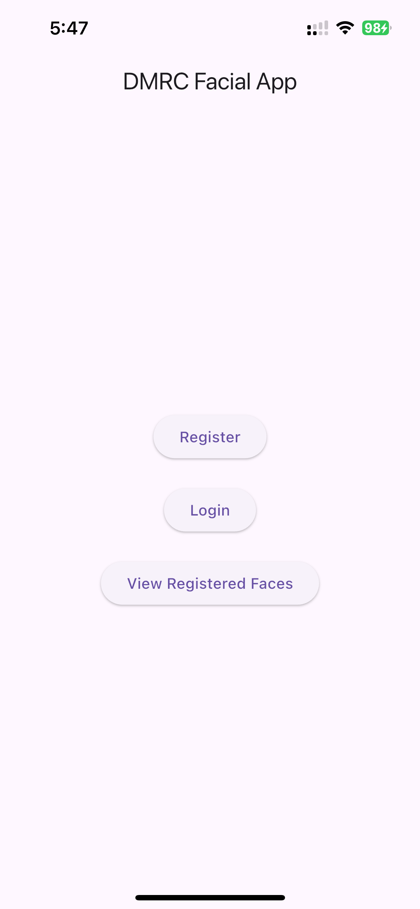

# 🛡️ DMRC Facial Recognition Attendance System

A mobile-based attendance system developed for **Delhi Metro Rail Corporation (DMRC)** employees, using **facial recognition** and **geofencing** to enable secure, contactless, and location-verified check-ins.

Built with **Flutter** on the frontend, **Flask (Python)** on the backend, and **local JSON + image storage** for lightweight deployment without any cloud dependency.

---

## 🚀 Features

- ✅ On-device facial recognition using employee face data  
- ✅ Real-time attendance logging with timestamps  
- ✅ Geofencing: ensures check-ins only within authorized DMRC premises  
- ✅ Local storage: no cloud required, all data is stored in a local folder  
- ✅ Admin-ready backend to view logs or integrate a dashboard  

---

## 📸 App Screenshots

| Home Screen | Register Screen |
|-------------|-----------------|
|  |  |

| Registered Users | Illegal Login Attempt |
|------------------|------------------------|
|  |  |

> 📝 *Place these images in a folder named `images/` in your repository.*

---

## 🧠 How It Works

1. **Registration Phase**  
   - Admin registers an employee via Flutter app by uploading name, employee ID, and a face image.  
   - Image is saved to `/faces/` directory and encoding is stored in `data.json`.

2. **Recognition Phase**  
   - Employee opens the app and scans their face.  
   - The app sends the image to the Flask backend.  
   - The backend compares the scanned face to known encodings and verifies identity.  
   - If successful, attendance is logged with the current timestamp.

3. **Geofencing**  
   - GPS coordinates are checked before allowing attendance.  
   - Ensures attendance can only be marked inside DMRC premises.

---

## 🧰 Tech Stack

| Component       | Technology                      |
|-----------------|---------------------------------|
| Frontend        | Flutter                         |
| Backend         | Python + Flask                  |
| Face Recognition| `face_recognition` library      |
| ML (Optional)   | TensorFlow Lite, Google ML Kit  |
| Storage         | Local JSON + Image Folder       |
| Geofencing      | Flutter Geolocator plugin       |

---

## 📂 Folder Structure

```
dmrc_attendance/
├── backend/
│   ├── app.py
│   ├── faces/             # Registered face images
│   └── data.json          # Encoded face metadata
├── flutter_frontend/
│   └── [Flutter app code]
├── images/
│   ├── home_screen.png
│   ├── register_screen.png
│   ├── registered_users.png
│   └── illegal_login.png
```

---

## ⚙️ Setup Instructions

### 🔧 Backend (Flask)

1. Clone this repository:
```bash
git clone https://github.com/yourusername/dmrc-attendance.git
cd dmrc_attendance/backend
```

2. Install Python dependencies:
```bash
pip install -r requirements.txt
```

3. Run the Flask server:
```bash
python app.py
```

By default, the server runs at `http://127.0.0.1:5000`

---

### 📱 Frontend (Flutter)

1. Open the `flutter_frontend/` folder in VS Code or Android Studio

2. Install Flutter dependencies:
```bash
flutter pub get
```

3. Run the app:
```bash
flutter run
```

---

## 🛠️ Endpoints

### `POST /register`  
Register a new employee face  
**Form fields**: `name`, `emp_id`, `image`

### `POST /recognize`  
Recognize face and return employee info  
**Form field**: `image`

---

## 📍 Future Improvements

- Admin dashboard with attendance logs and analytics  
- Export attendance to Excel/CSV  
- OTP-based fallback login  
- Multi-location geofencing support  
- Firebase/MongoDB cloud sync (optional)  

---

## 🤝 Contributions

Feel free to raise issues or submit pull requests. Make sure to follow proper commit naming conventions and comment your code.

---

## 📄 License

This project is licensed under the MIT License.  
Feel free to use and modify for non-commercial and educational purposes.

---

## 🙋‍♂️ Maintainer

**Hritish Mahajan**  
📧 hritishx@gmail.com  
🔗 [LinkedIn](https://linkedin.com/in/hritish-mahajan) | [GitHub](https://github.com/hritishmahajan)
